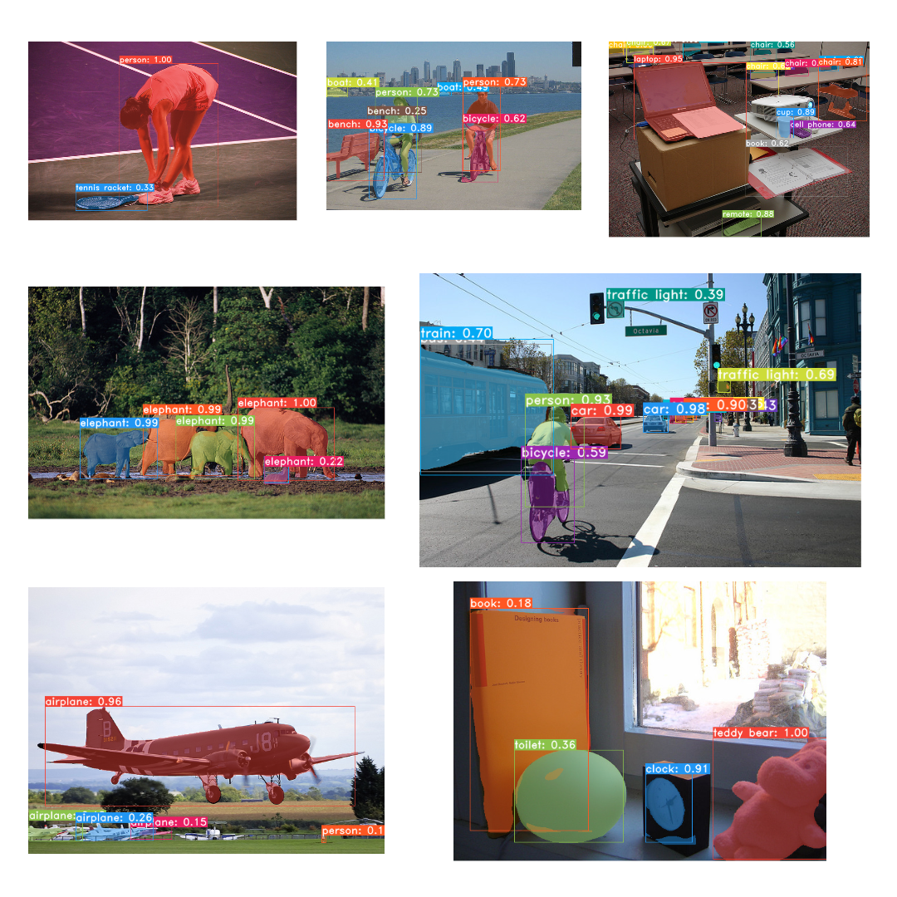

# yolact-ros-pro

ROS wrapper for Instance and Semantic Segmentation algorithm- Yolact.


## Related packages

This pakcage is modified from [yolact_ros](https://github.com/Eruvae/yolact_ros) and [mask_rcnn_ros](https://github.com/akio/mask_rcnn_ros).

## Installation
### Environment
Since Yolact uses Python 3, we highly recommand to use **a docker container of Ubuntu 20.04** to run this ROS package. Then install all python packages need by Yolact in that container.

We run `yolact_ros` in Ubuntu 20.04 docker container while our other ros code runs in a Ubuntu 18.04 docker container. Docker provides communication mechanism for ros nodes between different docker containers. 

### Build 
Git clone this repo into your ROS workspace. 
```bash
cd ~/catkin_ws/src
git@github.com:DeepDuke/yolact-ros-pro.git
```
Then build,

```bash
catkin_make
```
## Usage

First, download (or train) a model to use. You can find pre-trained models [here](https://github.com/dbolya/yolact#evaluation). The default model is [yolact_base_54_800000.pth](https://drive.google.com/file/d/1UYy3dMapbH1BnmtZU4WH1zbYgOzzHHf_/view?usp=sharing). If you want to use a Yolact++ model, you'll have to install DCNv2 (see [Yolact installation instructions](https://github.com/dbolya/yolact#installation)). Note that the DCN version shipped with Yolact does currently not work with the newest Pytorch release. An updated version can be found [here](https://github.com/jinfagang/DCNv2_latest).

We also provide our trained model, you can download from this link: [clink here to download model](https://drive.google.com/file/d/1RDzzF1W3p65_S2qPx02WDqLb8KibJbz5/view?usp=sharing)

You can run yolact using rosrun:
```Shell
  rosrun yolact_ros yolact_ros
```

If you want to change the default parameters, e.g. the model or image topic, you can specify them:
```Shell
  rosrun yolact_ros yolact_ros _model_path:="$(rospack find yolact_ros)/scripts/yolact/weights/yolact_base_54_800000.pth" _image_topic:="/camera/color/image_raw"
```

Alternatively, you can add the node to a launch file. An example can be found in the launch folder. You can run that launch file using:
```Shell
  roslaunch yolact_ros yolact_ros.launch
```

All parameters except for the model path are dynamically reconfigurable at runtime. Either run "rqt" and select the dynamic reconfigure plugin (Plugins -> Configuration), or run rqt_reconfigure directly ("rosrun rqt_reconfigure rqt_reconfigure"). Then select "yolact_ros" from the sidebar to see the available parameters.

The following parameters are available:

| Parameter             | Description                                                         | Default                 |
|-----------------------|---------------------------------------------------------------------|-------------------------|
| image_topic           | Image topic used for subscribing                                    | /camera/color/image_raw |
| use_compressed_image  | Subscribe to compressed image topic                                 | False                   |
| publish_visualization | Publish images with detections                                      | True                    |
| publish_detections    | Publish detections as message                                       | True                    |
| display_visualization | Display window with detection image                                 | False                   |
| display_masks         | Whether or not to display masks over bounding boxes                 | True                    |
| display_bboxes        | Whether or not to display bboxes around masks                       | True                    |
| display_text          | Whether or not to display text (class [score])                      | True                    |
| display_scores        | Whether or not to display scores in addition to classes             | True                    |
| display_fps           | When displaying video, draw the FPS on the frame                    | False                   |
| score_threshold       | Detections with a score under this threshold will not be considered | 0.0                     |
| crop_masks            | If true, crop output masks with the predicted bounding box          | True                    |
| top_k                 | Further restrict the number of predictions to parse                 | 5                       |
### ROS Topics
| Topic Name | Topic Messsage Type| Description |
|--- | ---|--- |
| /mask_rcnn/result | yolact_ros_msgs/Result| Instance segmantation results information, its message structure is same as in [mask_rccn_ros](https://github.com/akio/mask_rcnn_ros) package|
| /yolact_ros/detections | yolact_ros_msgs/Detections| Instance segmantation results information, the masks are represented by  uint8 array not sensors_msgs/Image in mask_rcnn_ros |
| /yolact_ros/visualization | sensor_msgs/Image | visualization of segmented image|